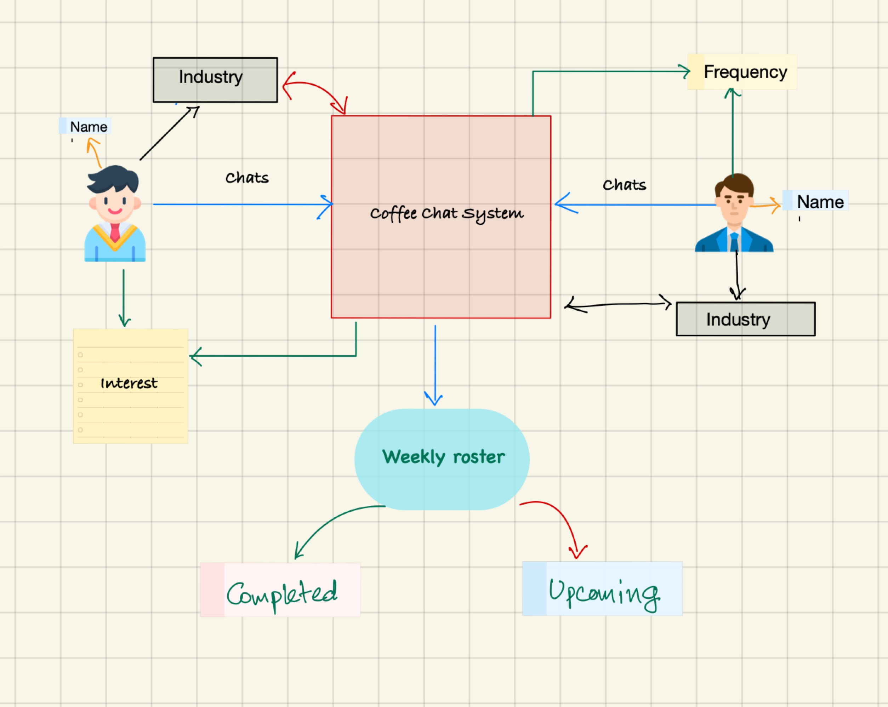

# Coffee Chats
### **Problem Statement**
You must Implement an intelligent algorithm in Python which shows, on a weekly basis, a list of coffee chats for every Aspiring Professional on the Platform. The curated list must take into account, among other factors, facts like the industry of the Aspiring Professional, industry of Senior Executives on the Platform, interests of the Aspiring Professional (as determined by activity on the Platform), frequency at which each Senior Executive has already been appearing on the roster, etc. A full solution will include the code, automated test cases and documentation of how the algorithm works. The algorithm should run as a separate, stand-alone process.

### **Requirement Analysis**
 - List of coffee chats (weekly basis)
    - Aspiring Professional
        - Industry Information
        - Interest
    - Senior Executive
        - Industry Information
        - Frequency of appearing

### **Data**
 - Aspiring Professional
    - User meta data
 - Senior Executive
    - User Meta data
 - Weekly Rooster
    - Upcoming Chats
        - listing of upcoming chats on weekly basis
    - Past Chats
        - listing of past chats on weekly basis

### **Solution Architecture**


### **Directory Structure**
```
.
├── README.md
└── Rahman_Habibur
    ├── README.md
    ├── data
    │   ├── aspiring_pro.json
    │   ├── coffee_chats.json
    │   ├── senior_ex.json
    │   └── sytem-architecture.jpg
    ├── requirements.txt
    └── src
        ├── coffee_chat.py
        ├── main.py
        ├── person.py
        ├── rooster.py
        ├── testset.py
        └── utils.py
```
## **Documentation**
- **_data_**: Subdirectory contains the example data that are used for this coffee chats system
    - **_aspiring_pro.json_**: Contains json array for Aspiring Professional
    - **_senior_ex.json_**: Contains json array for Senior Executive
    - **_coffee_chats.json_**: Contains the json array of upcoming and past coffee chats
- **_src_**: Subdirectory contains the main source code for this system
    - **_main.py_**: Entry point of the coffee chat system, loaded data from json files using the utils methods
    - **_person.py_**: Contains Person, AspiringProfessional and SeniorExecutive classes, where Person is the base class and AspiringProfessonal and SeniorExecutive are the derived classes from Person
    - **_coffee_chat.py_**: Contains the class for CoffeeChat, where the properties are $chatname, date, time, location, participants$ etc.
    - **_rooster.py_**: Contains the class for Rooster which has the property of Upcomming and Past chats
    - **_utils.py_**: Contains the beautification printing, and method for json data loading
    - **_testset.py_**: Contains multiple unit test method for testing several methods of different classes

## **Environment**
- python3.9

## **Installation, Build and Test**

To install requirements:
```
pip3 install -r requirements.txt
```

To build and run from the `Rahman_Habibur` subdirectory:

```
python3 src/main.py
```
Terminal output after successful run where upcomming and past chats are grouped by week:
```
Upcommings:
-----------------------------------------------------------------------------------------------------------------------------------------------------------
 Chat Name           Date      Time  Location                             Aspiring Professional                        Senior Executive
-----------------------------------------------------------------------------------------------------------------------------------------------------------
                                            Lastname | Firstname | Industry |  Interests         Lastname | Firstname |  Industry | Interests | Frequency
-----------------------------------------------------------------------------------------------------------------------------------------------------------
      Demo     2022-12-01     12:00      Hall  Micheal | Robert | Finance | Investing                      Asmaul | Husna | Agriculture  | Weekly
      Demo     2022-12-03     12:00      Hall  Micheal | Robert | Finance | Investing                Mccormick | Hernandez | Wholesale  | Monthly

-----------------------------------------------------------------------------------------------------------------------------------------------------------
  Showcase     2025-01-01     12:00   Theater  Habibur | Rahman | Finance | Investing                Mccormick | Hernandez | Wholesale  | Monthly
  Showcase     2025-01-02     12:00     Lobby  Micheal | Robert | Finance | Investing                Mccormick | Hernandez | Wholesale  | Monthly
-----------------------------------------------------------------------------------------------------------------------------------------------------------


Past:
-----------------------------------------------------------------------------------------------------------------------------------------------------------
 Chat Name           Date      Time  Location                             Aspiring Professional                        Senior Executive
-----------------------------------------------------------------------------------------------------------------------------------------------------------
                                            Lastname | Firstname | Industry |  Interests         Lastname | Firstname |  Industry | Interests | Frequency
-----------------------------------------------------------------------------------------------------------------------------------------------------------
  Showcase     2019-01-01     12:00   Theater  Habibur | Rahman | Finance | Investing                      Asmaul | Husna | Agriculture  | Weekly
  Showcase     2019-01-04     12:00   Theater  Habibur | Rahman | Finance | Investing                Mccormick | Hernandez | Wholesale  | Monthly

-----------------------------------------------------------------------------------------------------------------------------------------------------------
  Showcase     2019-12-12     12:00   Theater  Habibur | Rahman | Finance | Investing                      Asmaul | Husna | Agriculture  | Weekly

-----------------------------------------------------------------------------------------------------------------------------------------------------------
      Demo     2021-01-01     12:00      Hall  Micheal | Robert | Finance | Investing                Mccormick | Hernandez | Wholesale  | Monthly
      Demo     2021-01-02     12:00      Hall  Micheal | Robert | Finance | Investing                Mccormick | Hernandez | Wholesale  | Monthly
      Demo     2021-01-03     12:00      Hall  Micheal | Robert | Finance | Investing                      Asmaul | Husna | Agriculture  | Weekly
-----------------------------------------------------------------------------------------------------------------------------------------------------------

```
To run the testset from the `Rahman_Habibur` subdirectory:
```
python3 src/testset.py
```
Terminal output after successful testing:
```
.....
----------------------------------------------------------------------
Ran 5 tests in 0.001s

OK
```

## **Limitations**
- This CoffeeChats system, considered loading data from JSON file. It doesn't consider remote database.
- This system was designed on user perspective.
- This system was limited for only limited information about the Aspiring Professionals and Senior Executives like Name, Industry, Interest, etc.
- This totally console/terminal based application. It doesn't have interactive UI/UX.
- Limited number of testcases are available.

## **Future Works**
- Interactive UI/UX
- Both admin and User interface
- Remote data loading
- More related information on users, and many more.
